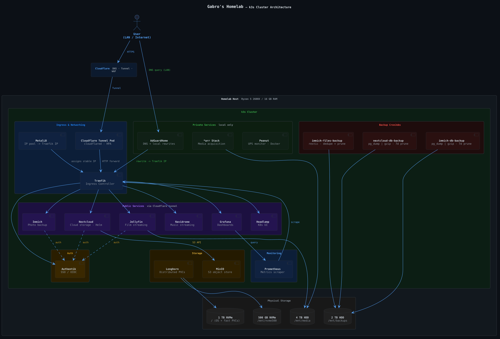

# Gabro's Homelab 🖥️

> A single-node k3s cluster with production-grade infrastructure — built to learn, experiment, and run self-hosted services.


---

## Cluster schema



---

## Hardware

Almost all hardware was recycled from previous upgrades, found laying around, or gifted by friends. The only purchases were the micro-ATX parts (mobo, case, PSU — cheapest available, student budget).

| Component    | Spec                |
| ------------ | ------------------- |
| CPU          | AMD Ryzen 5 2600X   |
| RAM          | 16 GB DDR4          |
| Boot / OS    | 1 TB Sabrent NVMe   |
| Storage NVMe | 500 GB Samsung NVMe |
| Media drive  | 4 TB HDD            |
| Backup drive | 2 TB HDD            |
| UPS          | 600 W               |

> Cloud storage services and the main OS run on the NVMe drives for speed.

---

## Software

| Layer              | Tool               |
| ------------------ | ------------------ |
| Kubernetes distro  | k3s                |
| Ingress controller | Traefik            |
| Load balancer      | MetalLB            |
| Remote access      | Cloudflare tunnels |
| Storage engine     | Longhorn           |
| Object storage     | MinIO              |
| Autoscaling        | HPA + VPA          |
| Monitoring         | Prometheus + Grafana |

Most configuration is deployed with standard `kubectl apply`. Helm is used for Nextcloud, Authentik, Jellyfin, MinIO, Prometheus/Grafana, and the VPA controller. No patches are applied to maximize reproducibility — pods are configured as-is in the YAML files.

Server is only accessed through VPN + SSH.

### How it works

1. **MetalLB** reserves an IP pool (`192.168.1.55–69`); Traefik is assigned a stable IP from it. AdGuard gets a dedicated LB IP (`192.168.1.60`).
2. **AdGuardHome** is configured with DNS rewrites so browsers can reach local services by hostname (e.g. `*.homelab.arpa`) via Traefik.
3. **Cloudflare tunnels** expose public services. Each service gets its own dedicated tunnel deployment, with tokens stored in Kubernetes secrets.
4. An aggressive **HPA** is configured on the Cloudflare tunnel deployment (up to 10 replicas, 50% CPU target) since performance scales linearly with pod count.
5. **PodDisruptionBudgets** protect critical services (AdGuard, Nextcloud, Cloudflare tunnels) during voluntary disruptions.
6. **VPAs** (in recommendation-only mode) are set up on the servarr stack and Nextcloud PostgreSQL for right-sizing guidance.

---

## Repo structure

```
.
├── apps/
│   ├── auth/            # Authentik SSO
│   ├── cloud/           # Nextcloud, Immich
│   ├── monitoring/      # Prometheus, Grafana, Headlamp, Peanut
│   ├── network/         # AdGuard, Cloudflare tunnels
│   ├── storage/         # MinIO, backup CronJobs
│   └── streaming/       # Jellyfin + servarr stack, Navidrome + Lidarr
├── infra/
│   ├── metallb/         # IP pool configuration
│   └── vpa/             # Vertical Pod Autoscaler values
└── schema/
    └── cluster-uml.png  # Architecture diagram
```

---

## Services

### 🌐 Public (via Cloudflare tunnel — `*.gabro.ovh`)

| Service                             | Purpose                            |
| ----------------------------------- | ---------------------------------- |
| [Nextcloud](https://nextcloud.com)  | General-purpose cloud storage      |
| [Immich](https://immich.app)        | Personal Google Photos alternative |
| [Jellyfin](https://jellyfin.org)    | Film & TV streaming                |
| [Navidrome](https://navidrome.org)  | Music streaming                    |
| [Authentik](https://goauthentik.io) | Centralized SSO / auth provider    |
| [Grafana](https://grafana.com)      | Monitoring & dashboards            |

### 🔒 Private (local only — `*.homelab.arpa`)

| Service       | Purpose                                  |
| ------------- | ---------------------------------------- |
| Servarr stack | Automated media acquisition (see below)  |
| AdGuardHome   | Network-level ad blocking + local DNS    |
| Headlamp      | Kubernetes web UI                        |
| Peanut        | UPS monitoring (NUT web frontend)        |
| MinIO Console | S3 object storage admin UI               |
| Prometheus    | Metrics collection                       |

### 📺 Servarr stack (Jellyfin)

All deployed in the `jellyfin` namespace, pinned to the node with `nodeSelector`, using `hostPath` volumes for config and media.

| App          | Role                    |
| ------------ | ----------------------- |
| Prowlarr     | Indexer manager         |
| Sonarr       | TV show management      |
| Radarr       | Movie management        |
| Seerr        | Request management UI   |
| qBittorrent  | Download client         |

### 🎵 Servarr stack (Navidrome)

Deployed in the `music` namespace.

| App    | Role                    |
| ------ | ----------------------- |
| Lidarr | Music library manager   |

---

## Storage

### Longhorn

[Longhorn](https://longhorn.io) manages distributed persistent volumes across the cluster and provides the default `StorageClass` used by most workloads. Immich PVCs use Longhorn disk selectors to target specific drives.

| Drive               | Mount          | Used for                         |
| ------------------- | -------------- | -------------------------------- |
| 1 TB Sabrent NVMe   | `/`            | OS + fast PVCs                   |
| 500 GB Samsung NVMe | `/mnt/nvme500` | Additional fast PVCs             |
| 4 TB HDD            | `/mnt/media`   | Jellyfin media library           |
| 2 TB HDD            | `/mnt/backups` | Backup target for all CronJobs   |

### MinIO

[MinIO](https://min.io) runs as an in-cluster S3-compatible object store in standalone mode, used as the primary storage backend for Nextcloud. A dedicated `nextcloud` bucket is provisioned with versioning enabled.

---

## Autoscaling

### Horizontal Pod Autoscalers (HPA)

| Target              | Min | Max | Metric                 |
| ------------------- | --- | --- | ---------------------- |
| Cloudflared tunnels | 1   | 10  | 50% CPU                |
| Nextcloud           | 1   | 3   | 60% CPU                |
| Immich Server       | 1   | 3   | 70% CPU / 90% memory   |
| Jellyfin            | 1   | 4   | 80% CPU                |

### Vertical Pod Autoscalers (VPA)

VPAs are deployed in recommendation-only mode (`updateMode: "Off"`) for Radarr, Sonarr, Lidarr, qBittorrent, Prowlarr, Seerr, and Nextcloud PostgreSQL — providing right-sizing suggestions without automatic restarts.

---

## Backups

All backup jobs are `CronJob` resources that write to the 2 TB HDD mounted at `/mnt/backups`. Jobs run every 3 days and are staggered 20 minutes apart to avoid I/O contention.

| CronJob                  | Schedule       | Method                                                                 |
| ------------------------ | -------------- | ---------------------------------------------------------------------- |
| `immich-files-backup`    | `0 3 */3 * *`  | [restic](https://restic.net) — dedup + prune (keep 7 daily, 4 weekly)  |
| `immich-db-backup`       | `20 3 */3 * *` | `pg_dump` → gzip, 7-day retention                                     |
| `nextcloud-db-backup`    | `40 3 */3 * *` | `pg_dump` → gzip, 7-day retention                                     |
| `nextcloud-minio-backup` | `0 4 */3 * *`  | `mc mirror` — incremental sync of the MinIO bucket                     |

All jobs have `activeDeadlineSeconds` set (1–4 hours) to prevent hung jobs, and `concurrencyPolicy: Forbid` to avoid overlapping runs.

---

## Nextcloud

Nextcloud is the most complex deployment in the cluster:

- **Helm chart** for the main Nextcloud pod with PostgreSQL and Redis sidecars.
- **S3 primary storage** via MinIO (`objectstore.config.php` configured in Helm values).
- **Dedicated CronJob** (`nextcloud-cron`) running `cron.php` every 5 minutes for background tasks.
- **AppAPI DSP** deployment for Nextcloud AI/app integrations (Docker Socket Proxy).
- **HSTS middleware** via Traefik (`stsSeconds: 15552000`, preload enabled).
- **PodDisruptionBudget** ensuring at least 1 pod is always available.
- **HPA** scaling up to 3 replicas on 60% CPU utilization.

---

## Monitoring

The monitoring stack is deployed via the `kube-prometheus-stack` Helm chart and includes:

- **Prometheus** with 10-day / 15 GB retention and 20 Gi persistent storage.
- **Grafana** with persistent dashboards (5 Gi), admin credentials from secrets.
- **Alertmanager**, **kube-state-metrics**, **node-exporter**, and the **Prometheus Operator** — all with resource requests and limits configured.
- **Peanut** — a NUT (Network UPS Tools) web frontend for UPS monitoring, connected to the UPS host.
- **Headlamp** — a Kubernetes web UI accessible locally at `headlamp.homelab.arpa`.

