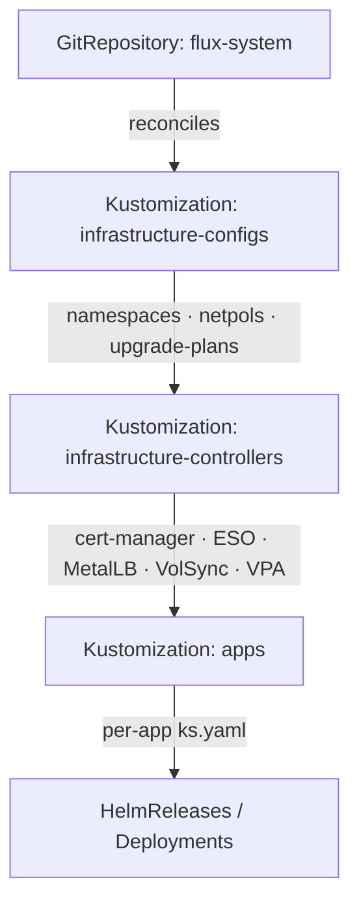
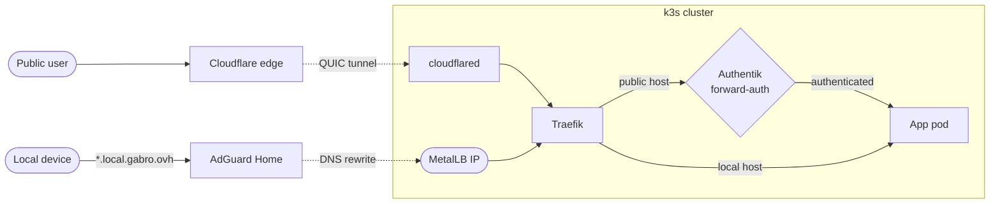

<div align="center">

# 🏠 Gabro's Homelab

_My home Kubernetes cluster — fully self-hosted, GitOps-managed, and reconciled straight from this repo._

[](https://k3s.io)
[](https://fluxcd.io)
[](https://www.mend.io/renovate)

[](https://github.com/Gabroz4/k-homelab/actions/workflows/kubeconform.yaml)
[](https://github.com/Gabroz4/k-homelab/actions/workflows/flux-local.yaml)
[](https://github.com/Gabroz4/k-homelab/commits/main)

</div>

---

## Overview

This is the single source of truth for my home Kubernetes cluster. Every workload, controller and bit of config lives here and is applied through GitOps — there is no manual `kubectl apply`, the `main` branch _is_ the desired state of the cluster. Most of the hardware was recycled from old upgrades or gifted by friends; the only things I actually bought were the cheapest micro-ATX parts I could find on a student budget.

It started as a way to learn Kubernetes properly and grew into the thing that runs my photos, media, files and identity. Along the way I tried to hold it to the standards I'd want at work: declarative config, no secrets in Git, automated dependency and node upgrades, append-only backups, and enough observability to know when something breaks before I do.

The whole thing is self-hosted. The only door to the outside world is a set of Cloudflare Tunnels — there are no ports forwarded on my router.

## Cluster

[k3s](https://k3s.io) across two nodes, split by responsibility. The x86 box is the control-plane and holds all persistent storage and stateful workloads; a Raspberry Pi sits alongside it, tainted `workload=stateless`, and runs lightweight pods (like the tunnels) pinned there through node affinity and tolerations.

### Core components

- **GitOps & automation** — [Flux](https://fluxcd.io) reconciles the cluster from this repo, [Renovate](https://www.mend.io/renovate) raises PRs for chart and image updates, and [system-upgrade-controller](https://github.com/rancher/system-upgrade-controller) upgrades k3s itself inside a weeknight maintenance window. A `Taskfile` covers the day-to-day commands.
- **Networking & ingress** — [Traefik](https://traefik.io) handles ingress, [MetalLB](https://metallb.io) gives it a stable LAN IP, [AdGuard Home](https://adguard.com/adguard-home/overview.html) does local DNS and filtering, and [cloudflared](https://github.com/cloudflare/cloudflared) publishes the public services over Cloudflare Tunnels.
- **Security & secrets** — [cert-manager](https://cert-manager.io) issues a wildcard certificate via Let's Encrypt DNS-01, [External Secrets](https://external-secrets.io) pulls every credential from [Bitwarden Secrets Manager](https://bitwarden.com/products/secrets-manager/) at runtime, and [Authentik](https://goauthentik.io) provides SSO and forward-auth. Namespaces enforce Pod Security Standards and each app carries a default-deny NetworkPolicy.
- **Storage & data** — [Longhorn](https://longhorn.io) for block PVCs, [MinIO](https://min.io) as an in-cluster S3 store behind Nextcloud, and [VolSync](https://github.com/backube/volsync) + [restic](https://restic.net) for backups against an append-only server.
- **Observability** — [kube-prometheus-stack](https://github.com/prometheus-community/helm-charts) for metrics and Alertmanager (routed to Telegram), [Loki](https://grafana.com/oss/loki/) + [Alloy](https://grafana.com/docs/alloy/latest/) for logs, and [Grafana](https://grafana.com) for dashboards.

### GitOps

[Flux](https://fluxcd.io) watches this repo and applies changes the moment they land on `main`. The entrypoint is `clusters/homelab`, which wires up the root Kustomizations in dependency order. Cluster-wide values — domains, timezone, IP ranges, host paths — live once in a `cluster-settings` ConfigMap and get substituted everywhere through `postBuild.substituteFrom`. A GitHub webhook hits the in-cluster `flux-webhook` receiver so reconciliation is near-instant instead of waiting on the poll interval.



### Layout

```
clusters/homelab     # Flux entrypoint — bootstrap + root Kustomizations + cluster-settings
infrastructure
├── configs          # namespaces, network policies, k3s upgrade plans
└── controllers      # cert-manager, external-secrets, metallb, volsync, vpa, coredns, ...
apps                 # one folder per workload (ks.yaml + manifests or HelmRelease)
schema               # cluster diagrams (PlantUML source + rendered PNGs)
```

<details>
<summary>Cluster diagram</summary>

<br>

<picture>
  <source media="(prefers-color-scheme: dark)" srcset="schema/cluster-schema-dark.png">
  <source media="(prefers-color-scheme: light)" srcset="schema/cluster-schema-light.png">
  
</picture>

</details>

## Services

### Public — via Cloudflare Tunnel

Each public service runs its own `cloudflared` deployment (named tunnel, token from Bitwarden), two replicas spread across both nodes with a `/ready` check on the edge connection so a disconnected tunnel actually fails its probe. Several sit behind Authentik forward-auth.

| Service | Purpose |
| --- | --- |
| [Jellyfin](https://jellyfin.org) | Film & TV streaming |
| [Nextcloud](https://nextcloud.com) | General-purpose cloud storage (MinIO S3 backend) |
| [Immich](https://immich.app) | Self-hosted photo backup |
| [Navidrome](https://navidrome.org) | Music streaming |
| [Authentik](https://goauthentik.io) | Centralized SSO / identity provider |
| [Grafana](https://grafana.com) | Monitoring & dashboards |
| [Headlamp](https://headlamp.dev) | Kubernetes UI |

### Local — via Traefik

Served on the LAN at `*.local.gabro.ovh`; AdGuard rewrites those hostnames to Traefik's MetalLB IP and Traefik presents the wildcard cert.

| Service | Purpose |
| --- | --- |
| \*arr stack | Prowlarr, Radarr, Sonarr, Lidarr, qBittorrent, Jellyseerr |
| [AdGuard Home](https://adguard.com/adguard-home/overview.html) | Network filtering + local DNS |
| Pankha | Fan / thermal control dashboard |
| Homepage | Service dashboard |

The nodes themselves are reachable only over VPN + SSH.

## Network

Both ingress paths land on the same Traefik instance — what differs is the hostname. Public hosts (`*.gabro.ovh`) arrive **only** through a Cloudflare Tunnel, with no inbound ports open on the router, and Traefik gates them with Authentik forward-auth. Local hosts (`*.local.gabro.ovh`) resolve through AdGuard's DNS rewrites straight to Traefik's MetalLB IP, never touching the public internet or the auth hop.



## Storage & backups

[Longhorn](https://longhorn.io) is the default `StorageClass`; a second `longhorn-single` class (one replica) is used where in-cluster replication buys nothing on a single storage node. [MinIO](https://min.io) runs standalone as the S3 backend for Nextcloud, with bucket versioning on.

Backups are [VolSync](https://github.com/backube/volsync) `ReplicationSource`s using [restic](https://restic.net), plus scheduled `pg_dump` jobs for the databases. They target an in-cluster `restic-rest-server` running in **`--append-only`** mode, so a compromised client can add snapshots but never delete or overwrite existing ones. Retention is 7 daily / 4 weekly / 12 monthly with a weekly prune, and a `restic-exporter` feeds Prometheus — I get alerted on stale repos, failed integrity checks, and jobs that "succeed" without actually writing data.

## Secrets

Nothing secret is committed. The repo references only **keys**; [External Secrets](https://external-secrets.io) resolves them from [Bitwarden Secrets Manager](https://bitwarden.com/products/secrets-manager/) at runtime, and [Reloader](https://github.com/stakater/Reloader) rolls workloads when a value changes. Rotation is scripted end-to-end in the `Taskfile`:

```sh
task autorotate-postgres app=nextcloud   # generate → write BW → ALTER USER → roll consumers
task rotate-tunnel       svc=jellyfin    # rotate a Cloudflare tunnel token
task autorotate-minio-nc-user            # rotate the shared MinIO / Nextcloud S3 user
task rotate-cloudflare-api               # rotate the cert-manager Cloudflare API token
```

## Operations

```sh
task status    # overview of every Flux Kustomization, HelmRelease and source
task bad       # show everything that is NOT Ready / Running
task reconcile # pull latest from Git and reconcile all root Kustomizations
task tree name=nextcloud   # list every resource a Kustomization manages
```

Every push is validated in CI by [kubeconform](https://github.com/yannh/kubeconform) (schema validation) and [flux-local](https://github.com/allenporter/flux-local) (offline build and diff of the Flux tree).

