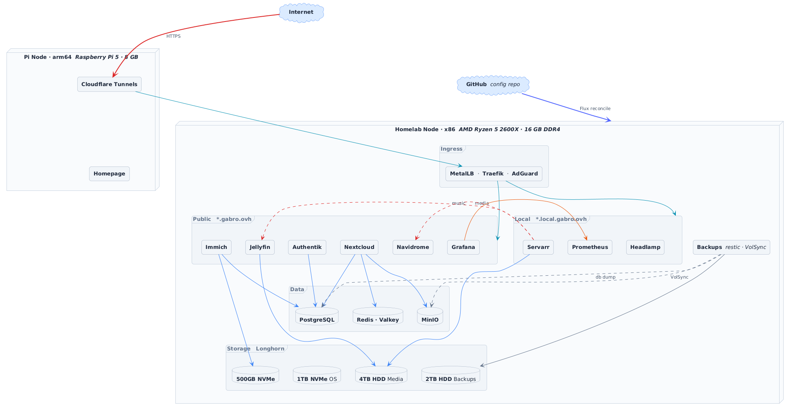

# Gabro's Homelab 🖥️

> A two-node **k3s** cluster managed entirely through **GitOps with Flux** — built to learn, experiment, and run self-hosted services with production-style practices: declarative everything, secrets out of Git, automated upgrades, append-only backups, and full observability.


---

## Architecture

<picture>
  <source media="(prefers-color-scheme: dark)" srcset="schema/cluster-schema-dark.png">
  <source media="(prefers-color-scheme: light)" srcset="schema/cluster-schema-light.png">
  
</picture>

---

## Highlights

What makes this more than a pile of `kubectl apply`:

- **Pure GitOps.** Flux reconciles the entire cluster from this repo. Nothing is applied by hand; `main` *is* the cluster state. A GitHub webhook triggers instant reconciliation.
- **Secrets never live in Git.** Every credential is pulled at runtime from **Bitwarden Secrets Manager** via External Secrets. The repo only ever references secret *keys*.
- **One-command secret rotation.** A full rotation runbook lives in the `Taskfile` — tunnel tokens, the Cloudflare API token, Postgres passwords (with live `ALTER USER`), MinIO credentials, Grafana admin, and the Flux webhook HMAC.
- **Append-only, alerted backups.** VolSync + restic write to an `--append-only` REST server (ransomware-resistant), with Prometheus alerts for stale snapshots, failed integrity checks, and the silent "exit 0 but wrote nothing" failure mode.
- **Automated, windowed upgrades.** The system-upgrade-controller rolls k3s on a stable channel inside a weeknight maintenance window.
- **Defense in depth.** Pod Security Standards per namespace, default-deny NetworkPolicies per app, non-root containers with `drop: ALL` and seccomp, node access over VPN + SSH only, and Authentik forward-auth in front of public apps.
- **Self-monitoring.** kube-prometheus-stack + Loki/Alloy, custom Grafana dashboards, and Alertmanager routing to Telegram.

---

## Cluster topology

A two-node k3s cluster with a clear stateful / stateless split.

| Node | Role | Notes |
| --- | --- | --- |
| `homelab` | control-plane + stateful | x86 (Ryzen 5 2600X). Hosts all storage (Longhorn, MinIO) and stateful workloads. |
| `pi-node` | agent / stateless | Raspberry Pi 5. Tainted `workload=stateless`; runs lightweight, stateless pods (e.g. Cloudflare tunnels) that are pinned here via node affinity + tolerations. |

The stateless node name is a cluster-wide variable (`${STATELESS_NODE}`) substituted by Flux, so workloads stay portable if the topology changes.

### Hardware

Almost all hardware was recycled from previous upgrades, found lying around, or gifted. The only purchases were the micro-ATX parts (mobo, case, PSU — cheapest available, student budget).

| Component | Spec |
| --- | --- |
| CPU | AMD Ryzen 5 2600X |
| RAM | 16 GB DDR4 |
| Boot / OS | 1 TB Sabrent NVMe |
| Fast storage | 500 GB Samsung NVMe |
| Media drive | 4 TB HDD |
| Backup drive | 2 TB HDD |
| Stateless node | Raspberry Pi 5 |
| UPS | 600 W (monitored via NUT) |

---

## Tech stack

| Layer | Tool |
| --- | --- |
| Kubernetes distro | k3s |
| GitOps engine | Flux CD |
| Dependency updates | Renovate |
| Ingress controller | Traefik |
| Load balancer | MetalLB |
| TLS certificates | cert-manager (Let's Encrypt, DNS-01 via Cloudflare) |
| Remote access | Cloudflare Tunnels (per-service, token-based) |
| Secrets | External Secrets + Bitwarden Secrets Manager |
| Block storage | Longhorn |
| Object storage | MinIO (S3-compatible) |
| Backups | VolSync + restic (append-only REST server) |
| Autoscaling | VPA (vertical) + HPA (horizontal) |
| Node upgrades | system-upgrade-controller |
| Monitoring | Prometheus / Alertmanager (kube-prometheus-stack) |
| Logs | Loki + Grafana Alloy |
| Dashboards | Grafana |
| Helpers | Reflector, Reloader, snapshot-controller |

---

## Repository layout

```
clusters/homelab/      # Flux entrypoint for this cluster
  flux-system/         #   Flux bootstrap (GitRepository + sync)
  infrastructure.yaml  #   → infrastructure-configs → infrastructure-controllers
  apps.yaml            #   → apps (depends on controllers)
  cluster-settings.yaml#   ConfigMap of cluster-wide variables (domains, paths, etc.)

infrastructure/
  configs/             # Namespaces (with Pod Security Standards), NetworkPolicies, k3s upgrade plans
  controllers/         # cert-manager, external-secrets, MetalLB, VolSync, VPA, CoreDNS, reflector, reloader, …

apps/                  # One directory per workload, each with its own Flux Kustomization (ks.yaml)
```

Flux reconciles in dependency order: **bootstrap → infrastructure-configs → infrastructure-controllers → apps**. Each layer substitutes variables from the `cluster-settings` ConfigMap via `postBuild.substituteFrom`, so domains, timezone, IP ranges, and host paths are defined once.

---

## How access works

### 🌐 Public services (via Cloudflare Tunnel)

Each public service has its own `cloudflared` Deployment running a **named tunnel** authenticated by a token (stored in Bitwarden, delivered via External Secrets — never in Git). Cloudflare's edge routes the hostname to the tunnel, which forwards to the in-cluster Service. Tunnel pods prefer the stateless `pi-node`. Several services sit behind **Authentik forward-auth** for SSO.

| Service | Purpose |
| --- | --- |
| [Jellyfin](https://jellyfin.org) | Film & TV streaming |
| [Nextcloud](https://nextcloud.com) | General-purpose cloud storage (MinIO S3 backend) |
| [Immich](https://immich.app) | Self-hosted photo backup (Google Photos alternative) |
| [Navidrome](https://navidrome.org) | Music streaming |
| [Authentik](https://goauthentik.io) | Centralized SSO / identity provider |
| [Grafana](https://grafana.com) | Monitoring & dashboards |
| [Headlamp](https://headlamp.dev) | Kubernetes UI |

### 🔒 Local-only services (via Traefik)

Reachable on the LAN at `*.local.gabro.ovh`. **AdGuard Home** serves DNS rewrites that point those hostnames at Traefik's stable MetalLB IP; Traefik terminates TLS with the cert-manager **wildcard certificate**.

| Service | Purpose |
| --- | --- |
| \*arr stack | Prowlarr, Radarr, Sonarr, Lidarr, qBittorrent, Jellyseerr — automated media acquisition |
| AdGuard Home | Network-level filtering + local DNS |
| Pankha | Fan / thermal control dashboard |
| NUT exporter | UPS monitoring |
| Homepage | Service dashboard |

Cluster nodes themselves are reachable only over **VPN + SSH**.

---

## Storage

### Longhorn

[Longhorn](https://longhorn.io) provides the default `StorageClass` for most workloads. A second class, **`longhorn-single`** (`numberOfReplicas: 1`), is used where in-cluster replication adds no value on a single storage node — it keeps PVCs lean and is also the cache class for VolSync movers.

| Drive | Role |
| --- | --- |
| 1 TB Sabrent NVMe | OS + fast PVCs |
| 500 GB Samsung NVMe | Additional fast PVCs |
| 4 TB HDD | Jellyfin media library |
| 2 TB HDD | Backup target (`/mnt/backups`) |

### MinIO

[MinIO](https://min.io) runs in **standalone** mode as an in-cluster S3-compatible object store, serving as the primary storage backend for Nextcloud. Bucket versioning is enabled, and the volume is backed up via VolSync. Reachable in-cluster at `http://minio.minio.svc.cluster.local:9000`.

---

## Observability

- **Metrics:** kube-prometheus-stack (Prometheus + Alertmanager). ServiceMonitors across Traefik, Longhorn, the restic REST server, and exporters.
- **Logs:** Loki, fed by Grafana Alloy.
- **Dashboards:** Grafana, with custom dashboards provisioned from ConfigMaps (Kubernetes overview, hardware, backups, logs).
- **Alerting:** Alertmanager routes to **Telegram**. Custom `PrometheusRule`s cover backup freshness, restic repo integrity, and infrastructure health.

---

## Backups & disaster recovery

All persistent data is protected by **VolSync `ReplicationSource`s** using **restic**, plus scheduled `pg_dump` jobs for databases.

- **Destination:** an in-cluster **`restic-rest-server`** running in **`--append-only`** mode — a compromised client can add snapshots but cannot delete or overwrite existing ones (ransomware resistance).
- **Retention:** 7 daily / 4 weekly / 12 monthly, with a weekly `restic prune`.
- **Verification:** a `restic-exporter` publishes snapshot freshness and `restic check` integrity to Prometheus, with **critical alerts** for stale repos, failed checks, a down REST server, and CronJobs that "succeed" without writing data.

> **Current limitation:** the backup repository lives on a drive inside the same physical host as the primary data, so it does not yet satisfy 3-2-1. Adding an offsite leg is the top roadmap item (see below).

---

## Secrets management

No secret material is ever committed. The repo references only **keys**; [External Secrets](https://external-secrets.io) resolves them from **Bitwarden Secrets Manager** (`ClusterSecretStore: bitwarden-secretsmanager`) at runtime, via an in-cluster Bitwarden SDK server. [Reloader](https://github.com/stakater/Reloader) rolls workloads when a secret changes.

Rotation is scripted end-to-end in the `Taskfile`:

```bash
task autorotate-postgres app=nextcloud   # generate → write BW → ALTER USER → roll consumers
task rotate-tunnel       svc=jellyfin    # rotate a Cloudflare tunnel token
task autorotate-minio-nc-user            # rotate the shared MinIO/Nextcloud S3 user
task rotate-cloudflare-api               # rotate the cert-manager Cloudflare API token
```

---

## Operations

A `Taskfile` wraps the common day-to-day commands:

```bash
task build        # smoke-test `kustomize build` of apps/ and infrastructure/
task status       # overview of all Flux Kustomizations, HelmReleases and sources
task bad          # show everything that is NOT Ready / Running
task reconcile    # pull latest from Git and reconcile every root Kustomization
task diff name=apps path=./apps   # preview what a Kustomization would change
task tree name=nextcloud          # list every resource a Kustomization manages
```

**CI:** every push is validated by GitHub Actions — `kubeconform` (schema validation) and `flux-local` (offline build/diff of the Flux tree). **Renovate** keeps Helm charts and container images up to date.

**Upgrades:** the system-upgrade-controller applies k3s upgrades from the `stable` channel within a Mon–Fri 02:00–04:00 (Europe/Rome) window, one node at a time with cordon + drain.

---

## Security posture

- **Pod Security Standards** enforced per namespace (`baseline`/`restricted` where workloads allow, `privileged` only where required).
- **Default-deny NetworkPolicies** scoped per application.
- Containers run **non-root** with `allowPrivilegeEscalation: false`, `capabilities: drop: ALL`, and `seccompProfile: RuntimeDefault`.
- **Secrets out of Git** entirely (External Secrets + Bitwarden).
- **Append-only backups** as a ransomware backstop.
- Node access restricted to **VPN + SSH**; public exposure only through Cloudflare Tunnels.

## Roadmap / known limitations

*Built and maintained by [Gabroz4](https://github.com/Gabroz4)*

