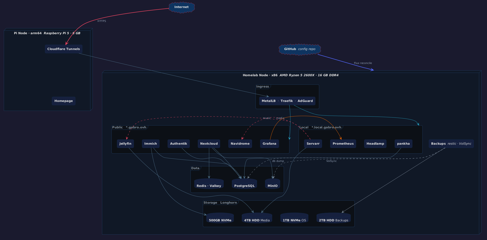

<div align="center">

# 🖥️ Gabro's Homelab

**A two-node k3s cluster — x86 primary + Raspberry Pi 5 — fully GitOps-managed with Flux.**

Built on recycled hardware to learn, experiment, and self-host the services I use every day.


</div>

---

## 🗺️ Cluster schema

<picture>
  <source media="(prefers-color-scheme: dark)" srcset="schema/cluster-schema-dark.png">
  <source media="(prefers-color-scheme: light)" srcset="schema/cluster-schema-light.png">
  
</picture>

---

## 📖 Overview

This repo is the single source of truth for my homelab: a small Kubernetes cluster running the cloud services I'd otherwise pay for — photos, files, media streaming — plus the monitoring and backups to keep them healthy.

Everything is declarative. I don't `kubectl apply` anything by hand; I commit a change and Flux reconciles the cluster to match. The repo is written to be forked and redeployed elsewhere, with all site-specific values isolated in one ConfigMap.

## ⛵ GitOps

[Flux](https://fluxcd.io) watches this repo and reconciles the cluster every 10 minutes — or instantly, via a GitHub push webhook. Pruning is enabled, so deleting a manifest deletes the resource.

- Helm charts are deployed as Flux `HelmRelease`s, with values kept inline in the repo.
- [Renovate](https://github.com/renovatebot/renovate) opens PRs for image and chart updates; digests and patches auto-merge once CI passes.
- Site-specific values (domain, timezone, paths, IP range) live in a single `cluster-settings` ConfigMap.

> Editing a Flux-managed resource directly is pointless — the next reconcile reverts it. Change the YAML, push, done.

## 🧰 Core components

| Component | Role |
| --------- | ---- |
| k3s | Lightweight Kubernetes distribution |
| Flux | GitOps reconciliation |
| Traefik | Ingress controller |
| MetalLB | Bare-metal load balancer |
| Cloudflare Tunnels | Public access without exposing the home IP |
| cert-manager | Let's Encrypt TLS certificates |
| Longhorn | Distributed block storage |
| MinIO | In-cluster S3-compatible object storage |
| Authentik | Single sign-on (Traefik forward-auth) |
| External Secrets + Bitwarden | Secret management |
| Prometheus + Grafana | Metrics & dashboards |
| Loki + Grafana Alloy | Log aggregation |
| restic + VolSync | Encrypted, deduplicated backups |

## 📦 Services

**Public** — exposed via Cloudflare Tunnel at `*.gabro.ovh`:

| Service | Purpose |
| ------- | ------- |
| [Nextcloud](https://nextcloud.com) | General-purpose cloud storage |
| [Immich](https://immich.app) | Self-hosted Google Photos alternative |
| [Jellyfin](https://jellyfin.org) | Film & TV streaming (SSO-gated) |
| [Navidrome](https://navidrome.org) | Music streaming (SSO-gated) |
| [Authentik](https://goauthentik.io) | SSO / identity provider |
| [Grafana](https://grafana.com) | Monitoring dashboards |
| [Homepage](https://gethomepage.dev) | Service launcher |

**Local only** — reachable on the LAN at `*.local.gabro.ovh`:

| Service | Purpose |
| ------- | ------- |
| AdGuardHome | Network-wide ad blocking + local DNS |
| Headlamp | Kubernetes web UI |
| MinIO Console | Object storage admin UI |
| Prometheus | Metrics collection |

<details>
<summary>📺 Media automation (the *arr stack)</summary>

Running in the `jellyfin` namespace alongside Jellyfin:

| App | Role |
| --- | ---- |
| Prowlarr | Indexer manager |
| Sonarr | TV show management |
| Radarr | Movie management |
| Seerr | Request management UI |
| qBittorrent | Download client |
| Dispatcharr | IPTV / channel manager |

And in the `music` namespace alongside Navidrome:

| App | Role |
| --- | ---- |
| Lidarr | Music library manager |

</details>

## 🌐 Networking & access

- MetalLB hands Traefik a stable LAN IP; AdGuardHome runs on its own dedicated address.
- Public services route through per-service Cloudflare Tunnels — TLS terminates at Cloudflare's edge, so nothing at home is port-forwarded.
- Local services use split-horizon DNS in AdGuardHome (`*.local.gabro.ovh` → Traefik), secured with a wildcard Let's Encrypt certificate from cert-manager and mirrored into every namespace by Reflector.
- The Raspberry Pi only takes stateless, taint-tolerating workloads (tunnels, Homepage, Authentik, parts of monitoring) via soft affinity — so it can be unplugged at any time without breaking scheduling.

## 🔐 Security

- **Network policies** — every namespace is default-deny for ingress and egress; each service gets only the rules it actually needs.
- **Pod Security Admission** — `baseline` (with `restricted` warnings) enforced per namespace; `privileged` only where hostPath or host namespaces are genuinely required.
- **Secrets** — nothing sensitive is committed. Values live in Bitwarden Secrets Manager and sync into the cluster through External Secrets Operator.
- **SSO** — Authentik gates selected services as a Traefik forward-auth middleware, so unauthenticated requests never reach the app.
- Host access is VPN + SSH only.

## 💾 Storage

[Longhorn](https://longhorn.io) provides the default StorageClass and replicated volumes, with Immich pinning specific PVCs to specific drives via disk selectors. [MinIO](https://min.io) runs an in-cluster S3 store used as Nextcloud's primary storage backend.

## ⚖️ Autoscaling

Cloudflare Tunnels, Nextcloud, and Immich scale horizontally on CPU load. Most workloads also have a Vertical Pod Autoscaler that right-sizes their resource requests automatically; a few are left in recommendation-only mode where auto-tuning caused churn.

## 📈 Observability

`kube-prometheus-stack` provides Prometheus, Grafana, and Alertmanager; Loki and Grafana Alloy handle log aggregation. Custom dashboards cover the cluster, hardware, backups, and logs. Alerts — failed backups, stale restic repositories, Loki ingestion gaps — are delivered to Telegram.

## 🛟 Backups

All backups are restic repositories on a dedicated 2 TB disk, written through an in-cluster restic REST server running in append-only mode:

- **Databases** — Postgres dumps for Immich, Nextcloud, and Authentik, every 3 days.
- **Bulk data** — the Immich photo library and the MinIO object store, handled by [VolSync](https://github.com/backube/volsync).
- A weekly job prunes old snapshots and verifies repository integrity; a Prometheus exporter raises an alert if any repo goes stale.

Retention is 7 daily / 4 weekly / 12 monthly snapshots.

## 🖥️ Hardware

Almost everything here was recycled from old upgrades, found laying around, or gifted by friends. The only purchases were the micro-ATX parts — motherboard, case, PSU — bought as cheap as possible on a student budget.

<details>
<summary>Specs</summary>

**Primary node (x86)**

| Component | Spec |
| --------- | ---- |
| CPU | AMD Ryzen 5 2600X |
| RAM | 16 GB DDR4 |
| Boot / OS | 1 TB Sabrent NVMe |
| Storage NVMe | 500 GB Samsung NVMe |
| Media drive | 4 TB HDD |
| Backup drive | 2 TB HDD |
| UPS | 600 W |

**Stateless node (arm64)**

| Component | Spec |
| --------- | ---- |
| Board | Raspberry Pi 5, 8 GB RAM |
| Taint | `workload=stateless:NoSchedule` |

</details>

## 📂 Repository layout

<details>
<summary>Directory tree</summary>

```
clusters/homelab/     # Flux entrypoint — components, sync, cluster-settings
apps/                 # one folder per workload (HelmRelease or plain manifests)
infrastructure/
  controllers/        # cluster-scoped controllers (cert-manager, ESO, MetalLB, VolSync…)
  configs/            # namespaces, network policies, upgrade plans
schema/               # architecture diagrams
```

Every leaf folder carries a `kustomization.yaml`, and each app folder a `ks.yaml` — the Flux `Kustomization` that reconciles it.

</details>
